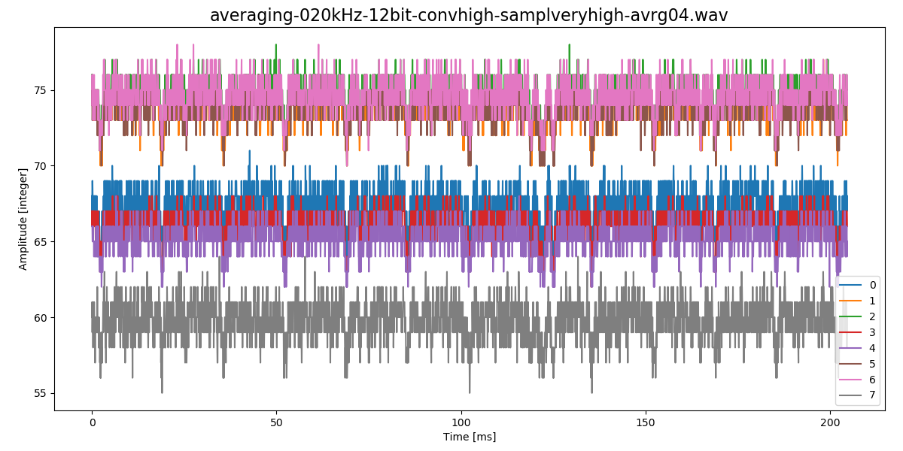
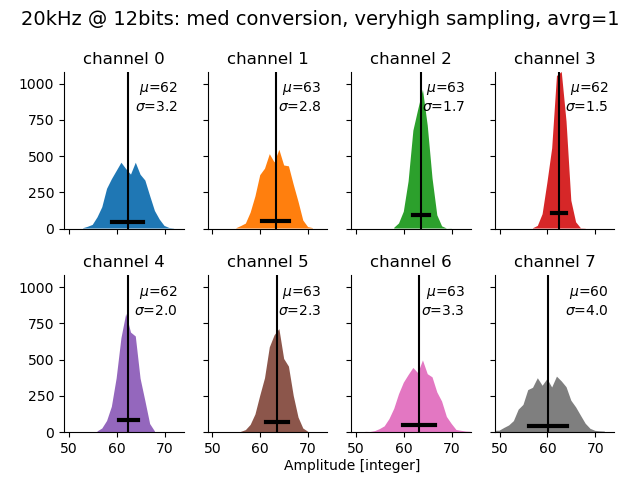
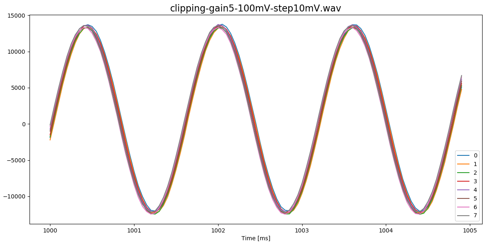
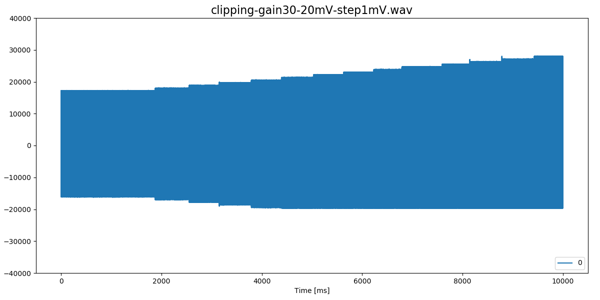
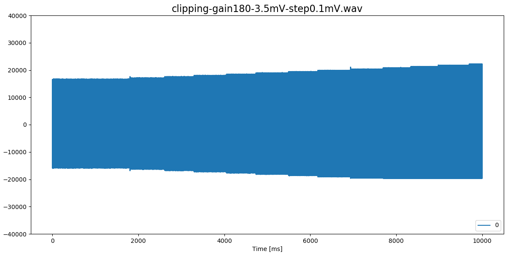
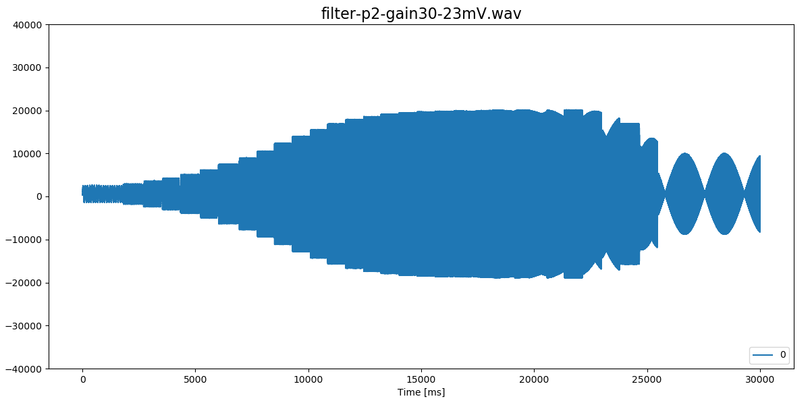
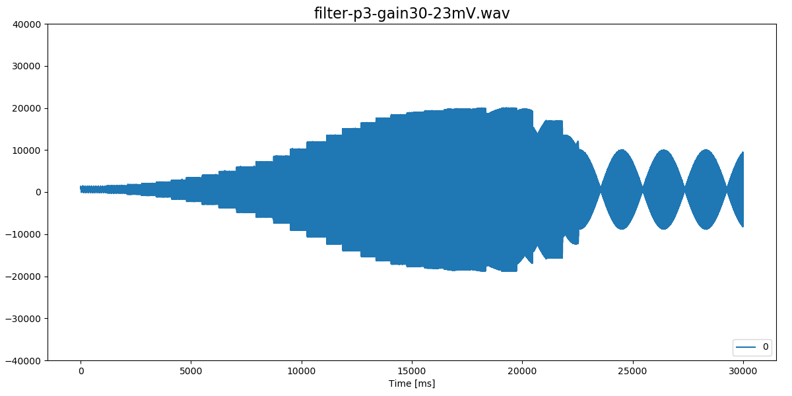

# 8-channel logger

Four of the two-channel amplifiers by Stefan Mucha ([TeensyAmp
R1.0](https://github.com/muchaste/Teensy_Amp)) are connected to a
[Teensy 3.5](https://www.pjrc.com/store/teensy35.html).

Designed by Jan Benda in November 2021.

The four amplifiers are mounted on the bottom side of the base plate:

On the upper side we have the Teensy, the power bank, and the screw
terminals for the 8 inputs and their reference:

## Wiring

JP3 pin 4 (0V) not connected to AGND or GND.

On Teensy, connecting AGND to GND seems to reduce noise a tiny bit.

## Noise levels

Running with 20 kHz at 12 bit resolution, the [averaging
sketch](https://github.com/janscience/TeeRec/blob/main/examples/averaging/averaging.ino)
of the [TeeRec](https://github.com/janscience/TeeRec) reports for the standard deviations of the raw integer readings:

| convers  | sampling | avrg |   A4 |   A2 |   A5 |   A3 |   A6 |  A20 |   A7 |  A22 |
| :------- | :------- | ---: | ---: | ---: | ---: | ---: | ---: | ---: | ---: | ---: |
| veryhigh | veryhigh |    1 |  2.1 |  1.9 |  1.3 |  1.2 |  1.5 |  1.9 |  2.0 |  2.8 |
| veryhigh | veryhigh |    4 |  1.7 |  1.5 |  1.7 |  1.1 |  1.5 |  1.1 |  1.7 |  1.5 |
| veryhigh | veryhigh |    8 |  2.4 |  1.1 |  2.4 |  1.1 |  1.4 |  1.4 |  1.4 |  1.6 |
| veryhigh | veryhigh |   16 |  1.4 |  0.9 |  0.8 |  0.9 |  1.2 |  0.8 |  1.1 |  0.9 |
| veryhigh | high     |    1 |  2.4 |  2.1 |  1.5 |  1.3 |  1.7 |  1.9 |  2.4 |  2.9 |
| veryhigh | high     |    4 |  1.8 |  1.7 |  1.5 |  1.6 |  1.7 |  1.6 |  1.4 |  1.7 |
| veryhigh | high     |    8 |  1.8 |  2.0 |  1.5 |  1.7 |  2.3 |  2.4 |  1.8 |  1.9 |
| veryhigh | med      |    1 |  2.4 |  1.9 |  1.5 |  1.3 |  1.6 |  1.7 |  2.5 |  3.2 |
| veryhigh | med      |    4 |  1.2 |  1.2 |  1.2 |  1.2 |  1.2 |  1.2 |  1.2 |  1.5 |
| veryhigh | med      |    8 |  2.6 |  2.4 |  3.0 |  2.4 |  2.0 |  2.3 |  2.1 |  2.4 |
| high     | veryhigh |    1 |  2.6 |  2.1 |  1.4 |  1.3 |  1.6 |  1.9 |  2.6 |  3.3 |
| high     | veryhigh |    4 |  2.9 |  2.9 |  2.8 |  3.0 |  2.9 |  3.0 |  2.9 |  3.0 |
| high     | veryhigh |    8 |  1.1 |  0.9 |  0.8 |  0.8 |  0.9 |  0.9 |  0.9 |  1.0 |
| high     | high     |    1 |  3.7 |  3.8 |  2.7 |  2.7 |  2.8 |  3.3 |  3.8 |  5.1 |
| high     | high     |    4 |  1.2 |  1.2 |  1.0 |  1.0 |  1.1 |  1.2 |  1.3 |  1.7 |
| high     | med      |    1 |  3.9 |  3.7 |  2.8 |  2.8 |  3.0 |  3.3 |  4.0 |  4.6 |
| high     | med      |    4 |  1.4 |  1.3 |  1.1 |  1.1 |  1.1 |  1.3 |  1.5 |  1.8 |
| med      | veryhigh |    1 |  4.0 |  3.7 |  3.0 |  2.9 |  3.2 |  3.4 |  4.1 |  4.7 |
| med      | veryhigh |    4 |  1.6 |  1.4 |  1.1 |  1.2 |  1.2 |  1.3 |  1.8 |  1.7 |
| med      | high     |    1 |  3.0 |  3.0 |  1.6 |  1.5 |  1.8 |  2.4 |  3.1 |  4.4 |
| med      | high     |    4 |  2.1 |  2.1 |  1.1 |  1.1 |  1.2 |  1.6 |  2.1 |  2.8 |
| med      | med      |    1 |  3.4 |  2.8 |  1.7 |  1.5 |  2.2 |  2.4 |  3.6 |  4.0 |

Amplifiers were connected wit their inputs short-circuited (IN+
connected to IN-). Recordings are stored in
[`tests/averaging`](https://github.com/janscience/TeeGrid/tree/main/8channel-logger/tests/averaging).

A good setting (traces plotted with [`viewwave.py`](https://github.com/janscience/TeeRec/blob/main/extras/viewwave.py), histograms with [`noise.py`](https://github.com/janscience/TeeRec/blob/main/extras/noise.py)):

A bad setting:

Running with 40 kHz at 12 bit resolution:

| convers  | sampling | avrg |   A4 |   A2 |   A5 |   A3 |   A6 |  A20 |   A7 |  A22 |
| :------- | :------- | ---: | ---: | ---: | ---: | ---: | ---: | ---: | ---: | ---: |
| veryhigh | veryhigh |    1 |  2.7 |  2.1 |  1.5 |  1.4 |  1.9 |  2.1 |  3.4 |  3.6 |
| veryhigh | veryhigh |    4 |  2.0 |  1.5 |  1.5 |  1.0 |  1.4 |  1.5 |  1.7 |  1.9 |
| veryhigh | high     |    1 |  2.2 |  2.5 |  1.4 |  1.4 |  1.6 |  2.5 |  3.1 |  3.9 |
| veryhigh | high     |    4 |  1.6 |  1.5 |  2.0 |  2.5 |  1.7 |  1.0 |  1.3 |  1.8 |
| veryhigh | med      |    1 |  3.9 |  3.9 |  3.5 |  3.3 |  3.5 |  3.9 |  4.3 |  4.9 |
| veryhigh | med      |    4 |  1.9 |  1.2 |  2.0 |  2.1 |  1.0 |  1.4 |  1.4 |  1.8 |
| high     | veryhigh |    1 |  4.4 |  4.2 |  3.8 |  3.7 |  4.0 |  4.1 |  4.9 |  5.3 |
| high     | high     |    1 |  4.1 |  4.1 |  3.6 |  3.6 |  3.8 |  4.1 |  4.3 |  5.3 |
| high     | med      |    1 |  3.7 |  3.5 |  3.1 |  3.0 |  3.2 |  3.5 |  4.0 |  4.7 |

## Channels

The [averaging
sketch](https://github.com/janscience/TeeRec/blob/main/examples/averaging/averaging.ino)
results in:
- ADC0: A0-A9 are good, A14-A15 are slightly more noisy.
- ADC1: A2-A3, A20, A22 are good, A12-A13, A16-A19 slightly more noisy (by 0.1)

We connect the 8 channels c0-c1 as follows:
- ADC0: A4 (c0), A5 (c2), A6 (c4), A7 (c6)
- ADC1: A2 (c1), A3 (c3), A20 (c5), A22 (c7)

## ADC settings

The noise measurements suggest the following settings:
- sampling rate: 20kHz (40kHz)
- resolution: 12bit
- averaging: 4
- conversion speed: high (very high)
- sampling speed: high (med)
- ADC0: A4, A5, A6, A7
- ADC1: A2, A3, A20, A22

These settings are saved in the sketch as well as in a configuration
file
[teegrid.cfg](https://github.com/janscience/TeeGrid/blob/main/8channel-logger/teegrid.cfg). If
you copy the configuration file onto the SD card, its settings will be
loaded by the sketch and override the ones of the sketch.

## Channel order

In files
[`tests/8channels-gain*.wav`](https://github.com/janscience/TeeGrid/tree/main/8channel-logger/tests)
a 630Hz signal was sequentially connected to the 8 channels. The
channels are connected in the right order!

## Polarity and gain

All channels connected to the same 630Hz sinewave signal.

## Gains and clipping

In files
[`tests/clipping-gain*-*mV-step*mV.wav`](https://github.com/janscience/TeeGrid/tree/main/8channel-logger/tests)
the amplitude of a 630Hz signal was increased from a start voltage in
steps as specified in the file name.

The signals are clipped at the bottom! This looks the same for all
channels and gains. Why?

## High- and low-pass filter

In files
[`tests/filter-p*-gain*.wav`](https://github.com/janscience/TeeGrid/tree/main/8channel-logger/tests)
the frequency of a 23mV signal was increased as follows: 10Hz, 12.5Hz,
16Hz, 20Hz, 25Hz, 31.5Hz, 40Hz, 50Hz, 63Hz, 80Hz, 100Hz, 125Hz, 160Hz,
200Hz, 250Hz, 315Hz, 400Hz, 500Hz, 630Hz, 800Hz, 1000Hz, 1250Hz,
1600Hz, 2000Hz, 2500Hz, 3150Hz, 4000Hz, 5000Hz, 6300Hz, 8000Hz,
10000Hz.

High-pass filter selection:
- p1: upper jumper right (0.1Hz)
- p2: upper jumper left (100Hz)
- p3: upper jumper cable left (300Hz)

100Hz high-pass filter, 7kHz low-pass filter:

300Hz high-pass filter, 7kHz low-pass filter:

## Real-time clock

On-board RTC, powered by battery separate battery.

When uploading a sketch (?) the real time clock is set to the one of
the host computer.

